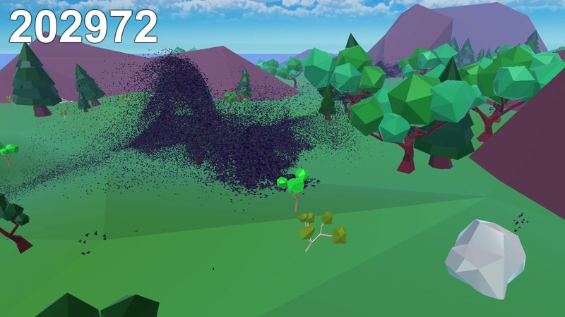

# Year of Unity - March: Murmurator

My third monthly game of 2022, a full week late! This probably counts as more of an _original concept_ compared to previous entries. It's based off the idea of gathering a [large flock of birds](https://www.youtube.com/watch?v=QOGCSBh3kmM). The original idea was extremely ambitious and had to be toned down considerably, but I'm still happy with the end result, even though it's not much fun as a game.

## Other People's Assets
This game uses quite a few assets from other people, they are as follows:
- Font from [Mystery Corgi](https://assetstore.unity.com/packages/2d/fonts/hana-pixel-font-29725#publisher)
- Background music from [kummelmusic](https://assetstore.unity.com/packages/audio/music/lofi-world-vol-1-7-free-music-tracks-214014) & [Time de Man](https://assetstore.unity.com/packages/audio/music/orchestral/open-air-adventure-light-music-pack-orchestra-piano-211800)
- Bird chirp sound effects from [no9 Game Sounds](https://assetstore.unity.com/packages/audio/sound-fx/animals/sparrow-sounds-158174#description)
- Skybox artwork from [Yuki2022](https://assetstore.unity.com/packages/2d/textures-materials/sky/free-stylized-skybox-212257)

## Goals
The ongoing theme with these games is trying to gain a better understanding of Unity & C#. It still seems to take me 3 or 4 iterations to neatly implement even basic component behaviors, but I felt more comfortable on this game than previous ones. Here were a few specific topics I wanted to focus on:

#### Implementing Boids
I've seen boids many times of the past several years, probably first from the [coding train](https://www.youtube.com/watch?v=mhjuuHl6qHM) and [Sebastian Lague](https://www.youtube.com/watch?v=bqtqltqcQhw). I wanted to implement a boid system for the bird flocking in this game. I followed [this](https://www.youtube.com/watch?v=mjKINQigAE4&list=PL5KbKbJ6Gf99UlyIqzV1UpOzseyRn5H1d) tutorial as a starting point, which as a bonus probably has the cleanest Unity code I've seen in any tutorial so far. Although I did get a 3D version working, I had trouble with performance as well as getting the look & feel I wanted. So ironically I ended up not using boids at all in this game, it's all VFX graph! Maybe I'll return to this in the future (or more likely try out some other related automata type behaviors).

#### Sound & Music
I felt really bad about not including ANY sound in my previous game, so I wanted to make up for it with this one. What I realized is that adding sound, and having it fit in nicely, is really almost an entire project on it's own. It's more time consuming and intricate than I realized. However, even just having background music seems to dramatically alter the _feel_ of the game, it's pretty cool.

#### 3D Camera Control
With my previous games I had very simple controls/camera work. I felt like it would be worthwhile to try to do a standard-ish third-person camera setup, especially after hearing about Cinemachine in Unity. While the camera stuff turned out to be surprisingly easy (at least for my basic use case), the movement along the ground was the most time consuming and frustrating part of the whole experience. I'm not still not pleased with it. Definitely need to watch out for movement & terrain navigation in the future, it's tough!

#### 3D Modeling
3D Graphics is increasing becoming an interesting topic for me, maybe it's the [pwnisher montages](https://www.youtube.com/watch?v=JXrWPLNp9tw) or the crazy stuff that [talented people](https://sketchfab.com/3d-models/submerged-era-e46a97e8ffff454f90ca5c5535e89090) come up with. So this game (being in 3D) was a good excuse to start trying to do basic models. I mostly followed (extremely good!) tutorials by [Grant Abbitt](https://www.youtube.com/watch?v=RjxIaq8OiQg&list=PLn3ukorJv4vsPy9J9x4--pat6jaPqNm11). I ended up doing 12 variations of trees haha, along with some other work.

## Future work
Lots of stuff was cut for the sake of time, in spite of the extra week of work:
- Better flocking behavior on the VFX, I messed with the settings so much I ended up ruining it somewhat
- Or just actually using boids!
- Making a my own custom skybox
- Ambient sound effects (e.g. water or the flutter of the birds)
- Add some nice shader effects, especially on water (I wanted to add a waterfall too!)
- Use of SDF-based collisions for the flock (to handle terrain collisions)
- A better intro, I wanted it to be 'within the world' instead of a separate screen, but ran out of time